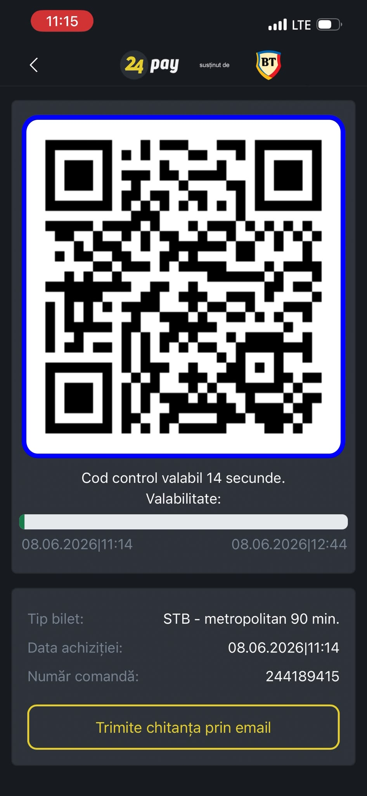
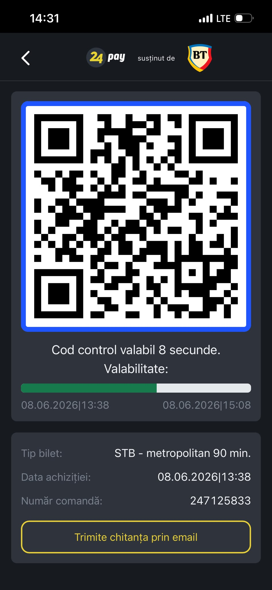

# Fake Transit Ticket: Visual-Trust Vulnerability Demo

A single-file static web page that visually clones the **24pay / STB** (Bucharest public transit) "control code" ticket screen, built with nothing but HTML, CSS, and JavaScript plus brand logos collected from open sources (basic OSINT-style asset gathering: a Google Images search for the 24pay and Banca Transilvania logos).

> ⚠️ **This is a security-research and educational demonstration only.** See the [disclaimer](#disclaimer) before reading further. Do **not** use it to evade fares.

## Real vs. clone

| Real 24pay app | This clone |
| :---: | :---: |
|  |  |

Same layout, logos, QR, countdown, and progress bar. At a glance they are interchangeable; only scanning the QR tells them apart.

## What it demonstrates

This project is a showcase of a simple but real class of vulnerability: **trusting visual appearance instead of cryptographic verification.**

A branded mobile app UI carries almost no inherent authority. With basic web skills and publicly available logos, anyone can reproduce a pixel-close replica of a payment/ticketing screen: rotating QR animation, countdown, progress bar, order number, and all. To a human glancing at a phone, the clone is indistinguishable from the genuine app.

The weak link is **the verification process, not the technology.** The system is only secure if the inspector actually scans the QR code and the backend validates it. In practice, visual inspection is often substituted for real validation, and that substitution is the entire vulnerability.

This sits at the intersection of:

- **OSINT / open-source asset collection:** the brand logos that sell the disguise are public and one image search away; their availability proves nothing about authenticity.
- **Application cloning:** branded UIs are trivially copyable; the logo and layout prove nothing.
- **Social engineering:** the artifact is designed to satisfy a human's *expectation* of what a valid ticket looks like.
- **Process superficiality:** when a manual visual check stands in for an automated/cryptographic one, it becomes a backdoor.

## The actual security finding

> **Visual inspection of a ticket is not authentication.**
> Any UI can be cloned. Only validating the QR/control code against the backend proves a ticket is real.

### Why the clone is "convincing" by design

The mock generates a fresh random QR every cycle and assigns a random elapsed lifetime within the 90-minute window, with padding at both ends of the range so the displayed times look like an ordinary, plausibly mid-life ticket rather than an obviously edge-case one. This realism is *the point of the demo*: it shows how little effort separates a throwaway HTML page from something a human reviewer would accept at a glance.

**It does not and cannot produce a valid ticket.** The QR encodes a random UUID with no relationship to any real backend. Scan it and verification fails immediately. The clone defeats *visual* inspection and nothing else, which is exactly the lesson.

## How the illusion completes on a phone

The strength of the demonstration is that the clone does not have to live inside a browser. Modern phones let any web page be "installed" to the home screen as a standalone web app, which strips the browser HUD (address bar, tabs, reload button). Launched that way, the page fills the screen and is visually indistinguishable from the real 24pay app: same icon on the home screen, same chrome-less full-screen view.

The flow is simply: open the live link in the phone browser, add it to the home screen, then launch it from the icon.

**iOS (Safari):**
1. Open **https://andreiopran.github.io/ticket/** in Safari.
2. Tap the **Share** button (square with an upward arrow).
3. Scroll down and tap **Add to Home Screen**.
4. Confirm with **Add**. An icon appears on the home screen; launching it opens full-screen with no Safari UI.

**Android (Chrome):**
1. Open **https://andreiopran.github.io/ticket/** in Chrome.
2. Tap the **three-dot menu** (top right).
3. Tap **Add to Home screen** (or **Install app**).
4. Confirm. The icon lands on the home screen and opens chrome-less.

This is the social-engineering payload: not the code itself, but the fact that an ordinary web page, one tap of "Add to Home Screen" away, presents exactly like a trusted native app.

## Mitigations (the defensive takeaway)

For operators of any ticketing/payment system relying on a displayed code:

- **Always scan and validate** the code server-side; never accept a ticket on appearance alone.
- **Cryptographically sign** ticket payloads (e.g. signed/expiring tokens) so a valid-looking code without a valid signature is rejected.
- **Bind tickets** to device/account/time so a static or replayed code is detectable.
- **Train inspectors** that the screen is not the proof; the scan is.

## Technical notes

One `index.html`, all markup/CSS/JS inline, one CDN dependency (`qrcode-generator`) with a deterministic pseudo-QR fallback if it fails to load.

Live demo: **https://andreiopran.github.io/ticket/**

## Disclaimer

- This project exists **solely** as a security and social-engineering awareness demonstration.
- Using a fake or counterfeit ticket to ride public transit is **fraud / fare evasion** and is **illegal** in most jurisdictions.
- The author does **not** endorse, encourage, or condone using this, or anything derived from it, to evade fares or deceive transit staff.
- The author accepts **no responsibility or liability** for anyone who misuses this project, and **no liability** for any consequences (including being caught, fined, or prosecuted) arising from such misuse.
- All trademarks and logos belong to their respective owners and are used here only to illustrate how easily branding can be replicated. No affiliation with or endorsement by 24pay, STB, or Banca Transilvania is implied.
